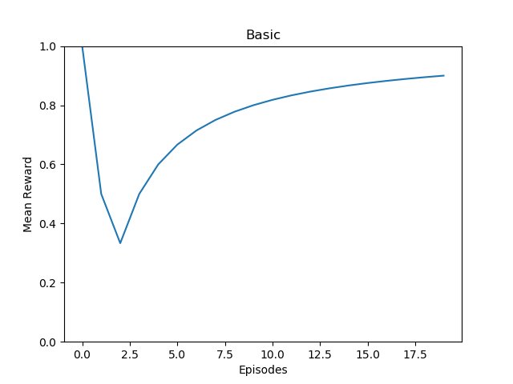

# DRL_Seminar

Deep Reinforcement Learning Seminar - ETH 2020 - Coding Challenge

The Goal of this challenge was to maximize the reward on 4 different variations of the game Blackjack. <br>
There are 4 modes:

- One-card dealer
- Regular Blackjack
- All the 2's
- Random values

## Approach

In order to solve the Blackjack problem, we implemented the DQN algorithm. The main challenge was the abstraction of the problem setting. We tried incorporating as many features as possible such that the agent is able to generalize to all 4 problem modes. Therefore, the state was modelled by concatenating the following features:

- sum of player's cards
- 21 - sum of player's cards
- the number of cards the player is holding
- value of dealer's card
- 21 - value of dealer's card
- current deck

The current deck is given by a modified version of the card value array in which the values of the cards that have already been drawn were set to zero. The modified value array incorporates knowledge about the remaining cards. This in combination with the other features leads to better decision making when choosing the action.

## Results

### Basic

### Regular



### All the 2's

### Random

## Installation

Clone repository:

```Bash
git clone https://github.com/pblatter/DRL_Seminar.git
```

Install dependencies:

```Bash
cd DRL_Seminar
conda create env -f conda_env.yml
conda activate drl-seminar
```

## Usage

In order to train the agent, run:

```Python
python DQN_solver.py --mode <mode>
```

where mode is an integer:

- 1: basic
- 2: regular
- 3: twos
- 4: random
