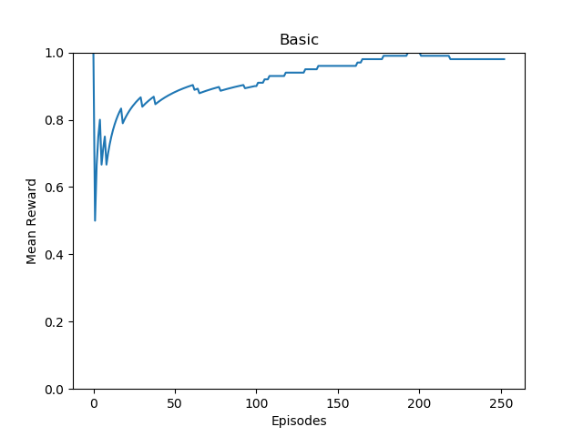
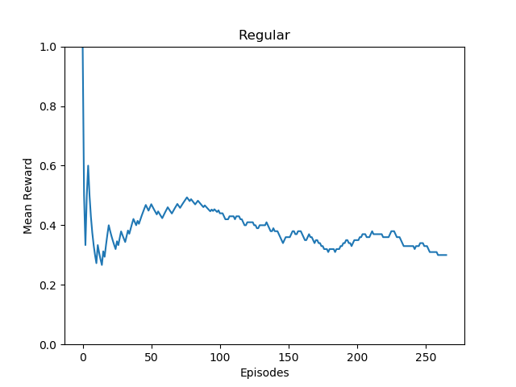
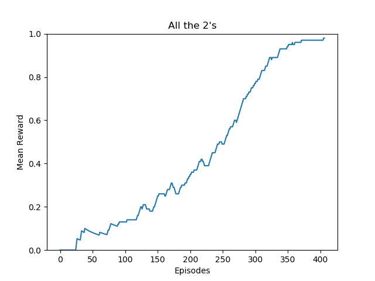
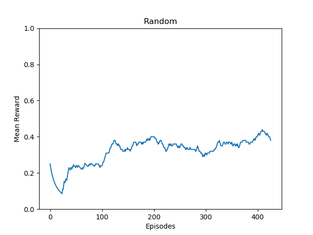

# DRL_Seminar

Deep Reinforcement Learning Seminar - ETH 2020 - Coding Challenge

The Goal of this challenge was to maximize the reward on 4 different variations of the game Blackjack. <br>
There are 4 modes:

- One-card dealer
- Regular Blackjack
- All the 2's
- Random values

## Approach

In order to solve the Blackjack problem, we implemented the DQN algorithm. The main challenge was the abstraction of the problem setting. We tried incorporating as many features as possible such that the agent is able to generalize to all 4 problem modes. Therefore, the state was modelled by concatenating the following features:

- sum of player's cards
- 21 - (minus) sum of player's cards
- the number of cards the player is holding
- value of dealer's card
- 21 - (minus) value of dealer's card
- current deck

The current deck is given by a modified version of the card value array in which the values of the cards that have already been drawn were set to zero. The modified value array incorporates knowledge about the remaining cards. This in combination with the other features leads to better decision making when choosing the action.

We use the same agent for all the different modes. The only thing that we tried to adapt to the specific task was the computation of the sum of the player's cards. For the first two modes we checked if the player had an ace and if so, we checked whether it could be counted as 11. However, the results were not significantly different. 

## Results

In order to measure the performance of the agent, we monitored the mean reward over the last 100 episodes (without the reward achieved during experience replay). The initial plan was to run the agent for 250 episodes per task, but as can be seen in the plots, for modes 3 and 4, the performance started increasing again after approximately 250 episodes. Therefore, we ran the agent for 425 episodes for modes 3 and 4. One interesting thing is that the mean reward converged towards 1 for tasks 1 and 3, whereas the mean reward of the agent was more volatile in tasks 2 and 4. One reason for that might be that in tasks 2 and 4, the behaviour of the sum of the dealer's cards cannot be predicted as easily as in tasks 1 and 3 due to the hidden card in the beginning. 

### Basic



The basic task seemed to be easily solvable for the agent. The mean reward converged to 0.99 after 250 episodes.

### Regular



This task seemed to be more problematic for the agent. One idea that has not been implemented yet is to decrease the frequency with which the weights are copied from the training to the target network, as the mean reward was volatile and changes with a frequency which was smaller than the weight copying frequency. The question then would be how this affects the performance of the agent on the other tasks.

### All the 2's



As mentioned above, in this task the agent needed more time to figure out how to solve the problem but finally managed to solve it. 

### Random



Similar to the second mode of the game, the mean reward was rather volatile. We argue that the agent kind of got the idea of the game (getting to 21 points) but due to the dealer's hidden card in the beginning, there is always the possibility to lose - that's life!

## Installation

Clone repository:

```Bash
git clone https://github.com/pblatter/DRL_Seminar.git
```

Install dependencies:

```Bash
cd DRL_Seminar
conda env create --file blackjack.yml
conda activate blackjack
```

## Usage

### Training

In order to train the agent, run:

```Python
python DQN_solver.py --mode <mode> --version <version> --best_mean_reward <bmr>
```

**mode**: the integer indicating which game mode you want to run:

- 1: basic
- 2: regular
- 3: twos
- 4: random


**version**: the name of the current run and can be chosen by the user. It is relevant for the paths of the log file and the checkpoints.

**best_mean_reward**: We only store checkpoints if the mean reward increases. Therefore, if you want to further train your agent, you only want checkpoints to be stored if the agent actually performs better than before. Therefore, it has to know the best mean reward of the past episodes. Simply run: 
```Python
python3 compute_bmr.py --mode <mode> --version <version>
```
in order to get the best mean reward of the past training episodes. The exact same setup as before will automatically be initialized in order to enable a hassle-free continuation of the training period.

If you run training command with a combination of **mode** and **version** and the appropriate **best_mean_reward** value, training will resume where it ended. This can used to evaluate the methods. Simply run 
```Python
python3 DQN_solver.py --mode <mode> --version v1 --best_mean_reward 0.99
```

### Plotting
In order to plot the mean reward that the agent got, simply run: 

``` Python
python3 plot_generation.py --mode <mode> --version <version>
```